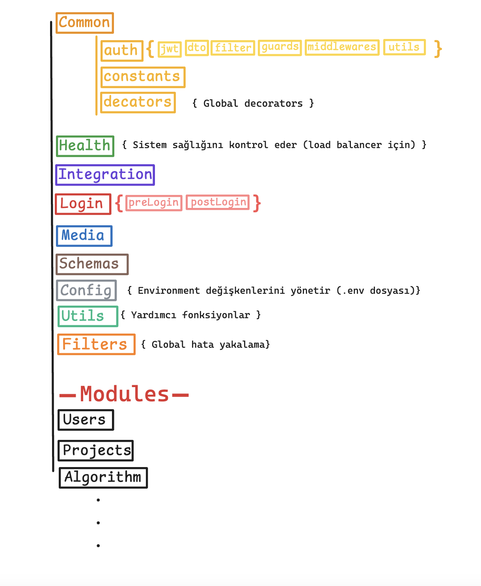
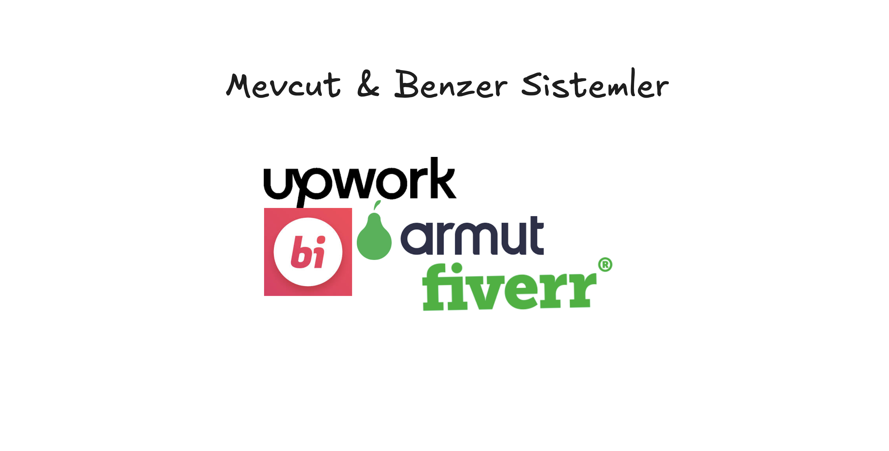
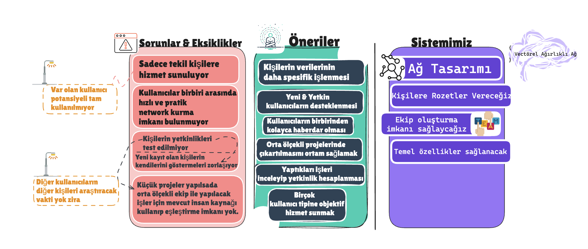
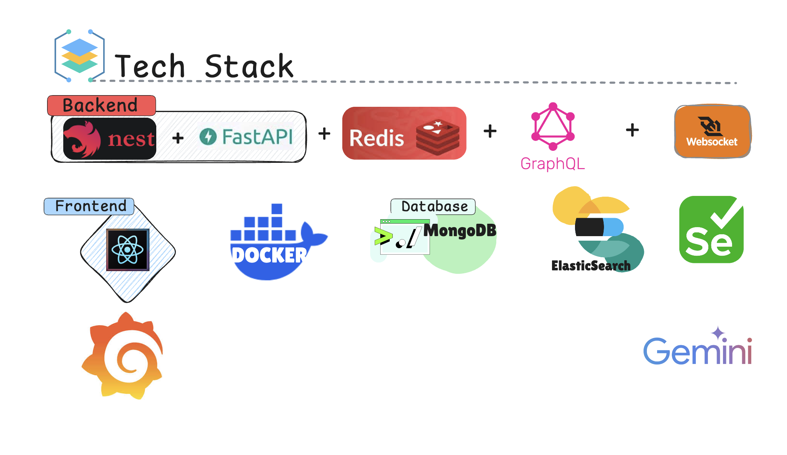
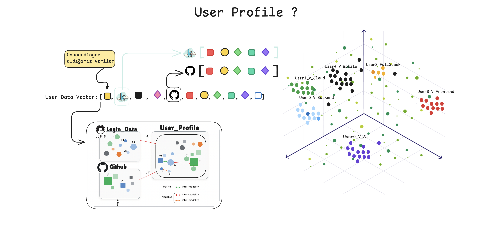
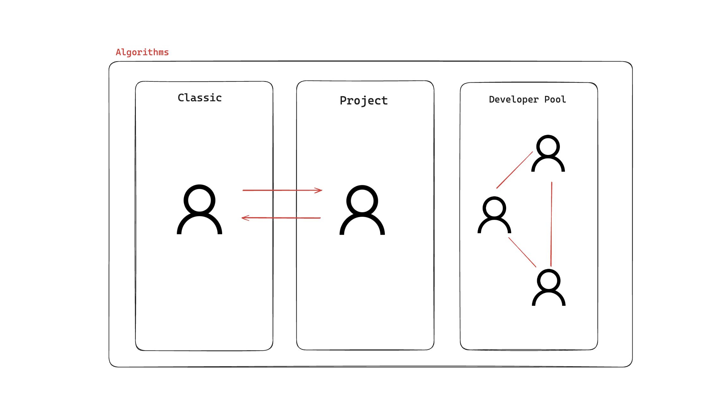
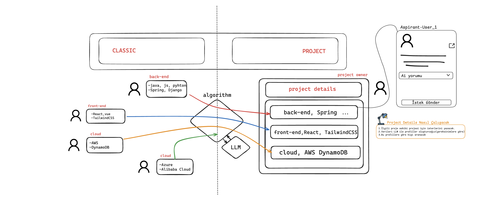
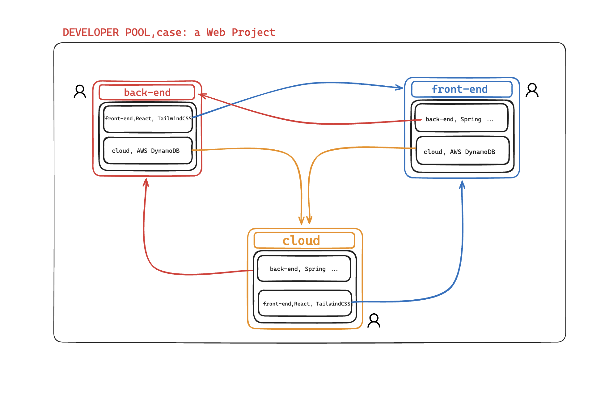

# 🚀 LabProject Backend NestJS

Bu proje, NestJS framework'ü kullanılarak geliştirilmiş bir backend uygulamasıdır. Modüler, ölçeklenebilir ve bakımı kolay bir yapıya sahiptir.

## 📋 Sprint Genel Bakış

<h3>🚀 Sprint 1: Temel Yapılandırma ve Kimlik Doğrulama</h3>

Bu sprint'te projenin temel yapısı oluşturuldu, kimlik doğrulama (authentication) ve yetkilendirme (authorization) mekanizmaları entegre edildi.

### 🏗️ Mimari Genel Bakış

Aşağıdaki diyagram, uygulamanın ana modüllerini ve bileşenlerini göstermektedir:

  

### 📁 Modül ve Katman Görev Tanımları

<strong>📁 Common Modülü</strong>

Uygulama genelinde tekrar kullanılan, paylaşımlı bileşenleri içerir. Bu modül, farklı özellik modülleri arasında kod tekrarını önlemek ve merkezi yönetim sağlamak amacıyla tasarlanmıştır.

<ul>
    <li><strong><code>auth/</code>: Kimlik Doğrulama Sistemi</strong>
        <ul>
            <li><code>jwt/</code>: JSON Web Token (JWT) oluşturma, doğrulama ve yönetimi ile ilgili stratejileri ve yardımcıları barındırır.</li>
            <li><code>dto/</code>: Kimlik doğrulama işlemleri için kullanılan Data Transfer Object'leri (DTO) tanımlar (örn. LoginDto, RegisterDto).</li>
            <li><code>filter/</code>: Kimlik doğrulama ve yetkilendirme sırasında oluşabilecek hataları yakalayan ve standart bir yanıt formatında döndüren exception filter'ları içerir.</li>
            <li><code>guards/</code>: Belirli endpoint'lere erişimi kontrol eden yetkilendirme koruyucularını (guards) barındırır (örn. JwtAuthGuard, RolesGuard, GoogleAuthGuard).</li>
            <li><code>middlewares/</code>: Kimlik doğrulama akışında kullanılan özel middleware'leri içerir (örn. RateLimitMiddleware).</li>
            <li><code>utils/</code>: Kimlik doğrulama ile ilgili yardımcı fonksiyonları (örn. şifre hashleme, token işlemleri) barındırır.</li>
        </ul>
    </li>
    <li><strong><code>constants/</code>: Sabit Değerler</strong>
        <ul>
            <li>Uygulama genelinde kullanılan sabit değerleri (örn. JWT sırları, rol isimleri) merkezi bir yerde tutar.</li>
        </ul>
    </li>
    <li><strong><code>decators/</code>: Global Decorator'lar</strong>
        <ul>
            <li>Uygulama genelinde kullanılabilen özel NestJS decorator'larını (örn. <code>@Roles</code>, <code>@Public</code>) tanımlar. Bu decorator'lar, metadataları yöneterek yetkilendirme veya diğer davranışları dinamik olarak kontrol etmeyi sağlar.</li>
        </ul>
    </li>
</ul>

<strong>🏥 Health Modülü</strong>

Uygulamanın sağlık durumunu kontrol etmek için bir endpoint sağlar. Özellikle Load Balancer'lar, konteyner orkestrasyon araçları (Docker, Kubernetes) ve izleme sistemleri tarafından uygulamanın çalışır durumda olup olmadığını anlamak için kullanılır.

<ul>
    <li><strong>Amaç:</strong> Sistem sağlığını kontrol eder (load balancer için).</li>
</ul>

<strong>🔗 Integration Modülü</strong>

Harici servislerle entegrasyonları yönetmek için ayrılmış bir modüldür. Bu modül, üçüncü taraf API'lerle iletişim kurma veya farklı sistemler arasında veri alışverişi yapma gibi görevleri üstlenebilir.

<ul>
    <li><strong>Amaç:</strong> Harici servis entegrasyonlarını yönetir.</li>
</ul>

<strong>🚪 Login Modülü</strong>

Kullanıcı giriş/çıkış akışlarını ve bu akışlarla ilgili özel işlemleri yönetir. Bu modül, kimlik doğrulama (AuthModule) ile entegre çalışarak kullanıcı deneyimini şekillendirir.

<ul>
    <li><strong><code>preLogin/</code>: Giriş Öncesi İşlemler</strong>
        <ul>
            <li>Kullanıcının giriş yapmadan önce gerçekleştirmesi gereken veya giriş ekranında sunulan işlemleri (örn. şifremi unuttum, kayıt ol) içerir.</li>
        </ul>
    </li>
    <li><strong><code>postLogin/</code>: Giriş Sonrası İşlemler</strong>
        <ul>
            <li>Kullanıcı başarılı bir şekilde giriş yaptıktan sonra tetiklenen veya giriş sonrası kullanıcıya özel bilgileri sağlayan işlemleri (örn. kullanıcı profili yükleme, oturum yönetimi) içerir.</li>
        </ul>
    </li>
</ul>

<strong>🖼️ Media Modülü</strong>

Uygulamanın medya dosyalarını (resimler, videolar vb.) yükleme, depolama, işleme ve sunma gibi görevlerini yönetir. Dosya yükleme API'leri, depolama entegrasyonları (örn. bulut depolama) bu modülde yer alabilir.

<ul>
    <li><strong>Amaç:</strong> Medya dosyalarını yönetir.</li>
</ul>

<strong>📝 Schemas Modülü</strong>

Veritabanı modellerinin (şemalarının) tanımlandığı yerdir. Mongoose gibi ORM'ler kullanılıyorsa, bu modül MongoDB koleksiyonlarının yapısını belirleyen şema dosyalarını içerir.

<ul>
    <li><strong>Amaç:</strong> Veritabanı şemalarını (örn. UserSchema) tanımlar.</li>
</ul>

<strong>⚙️ Config Modülü</strong>

Uygulamanın çalışma zamanı yapılandırmasını yönetir. Çevre değişkenlerini (environment variables) okur ve uygulamanın farklı ortamlar (geliştirme, test, üretim) için dinamik olarak yapılandırılmasını sağlar.

<ul>
    <li><strong>Amaç:</strong> Environment değişkenlerini yönetir (.env dosyası).</li>
</ul>

<strong>🛠️ Utils Modülü</strong>

Uygulama genelinde kullanılan genel amaçlı yardımcı fonksiyonları ve sınıfları barındırır. Bu fonksiyonlar, belirli bir modüle ait olmayan ancak birçok yerde ihtiyaç duyulan işlemleri (örn. tarih formatlama, string manipülasyonu) gerçekleştirir.

<ul>
    <li><strong>Amaç:</strong> Yardımcı fonksiyonlar sağlar.</li>
</ul>

<strong>🚫 Filters Modülü</strong>

Uygulama genelinde meydana gelen hataları yakalayan ve bu hatalara standart bir yanıt formatı uygulayan exception filter'ları içerir. Bu, API'nin tutarlı hata mesajları döndürmesini sağlar.

<ul>
    <li><strong>Amaç:</strong> Global hata yakalama mekanizması sunar.</li>
</ul>

<strong>👥 Users Modülü</strong>

Kullanıcı yönetimi ile ilgili tüm iş mantığını ve API endpoint'lerini içerir. Kullanıcı oluşturma, okuma, güncelleme ve silme (CRUD) işlemleri bu modül tarafından yönetilir.

<ul>
    <li><strong>Amaç:</strong> Kullanıcı CRUD işlemlerini ve yönetimini sağlar.</li>
</ul>

<strong>📂 Projects Modülü</strong>

Proje yönetimi ile ilgili işlevselliği barındırır. Proje oluşturma, listeleme, güncelleme ve silme gibi operasyonlar bu modül altında toplanır.

<ul>
    <li><strong>Amaç:</strong> Proje yönetimi işlevselliğini sağlar.</li>
</ul>

<strong>🧠 Algorithm Modülü</strong>

Uygulamanın çekirdek iş mantığını veya karmaşık hesaplamaları içeren algoritmik işlemleri barındırır. Bu modül, diğer modüller tarafından çağrılabilecek özel algoritmaları veya veri işleme mantığını içerebilir.

<ul>
    <li><strong>Amaç:</strong> Uygulamanın algoritmik ve karmaşık iş mantığını içerir.</li>
</ul>

### 📸 Sprint 1 Ekran Görüntüleri

  

    
  

  

    
  

  

    
  

  

    
  

  

    
  

  

    
  

  

    
  

  

    
  

### ✅ Completed Features
- [x] User registration with validation
- [x] JWT-based authentication
- [x] Role-based access control (Admin/User)
- [x] Refresh token mechanism
- [x] Swagger API documentation
- [x] Password hashing with bcrypt
- [x] MongoDB integration
- [x] Error handling and validation

### 🛠️ Technical Stack
- **Backend:** NestJS, TypeScript
- **Database:** MongoDB with Mongoose
- **Authentication:** JWT, Passport.js
- **Documentation:** Swagger/OpenAPI
- **Security:** bcrypt, HttpOnly cookies

### 🔧 Key Components
- `AuthModule` - Centralized authentication
- `UsersModule` - User management
- `PreloginModule` - Pre-authentication operations
- `PostloginModule` - Post-authentication operations
- `RolesGuard` - Role-based access control
- `JwtAuthGuard` - JWT token validation

<h3>🚀 Sprint 2 - Coming Soon</h3>

<h3>🚀 Sprint 3 - Future Development</h3>

