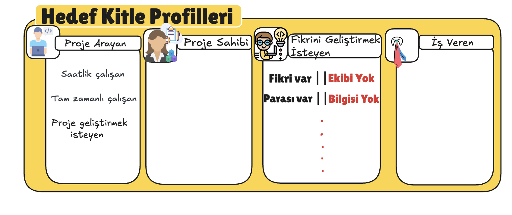

# LabProject Backend - NestJS

## 📋 Sprint Overview

<details>
<summary><h3>🚀 Sprint 1 - Authentication & Authorization System</h3></summary>

### 🎯 Sprint Goals
- Centralized authentication system
- JWT token management
- Role-based access control (RBAC)
- Swagger API documentation
- Pre-login and Post-login module separation

### 📸 Sprint 1 Screenshots

<div style="display: flex; flex-wrap: wrap; gap: 10px;">
  <div style="flex: 1; min-width: 300px;">
    
  </div>
  <div style="flex: 1; min-width: 300px;">
    
  </div>
</div>

<div style="display: flex; flex-wrap: wrap; gap: 10px;">
  <div style="flex: 1; min-width: 300px;">
    
  </div>
  <div style="flex: 1; min-width: 300px;">
    
  </div>
</div>

<div style="display: flex; flex-wrap: wrap; gap: 10px;">
  <div style="flex: 1; min-width: 300px;">
    
  </div>
  <div style="flex: 1; min-width: 300px;">
    
  </div>
</div>

<div style="display: flex; flex-wrap: wrap; gap: 10px;">
  <div style="flex: 1; min-width: 300px;">
    
  </div>
  <div style="flex: 1; min-width: 300px;">
    
  </div>
</div>

<div style="display: flex; flex-wrap: wrap; gap: 10px;">
  <div style="flex: 1; min-width: 300px;">
    
  </div>
</div>

### ✅ Completed Features
- [x] User registration with validation
- [x] JWT-based authentication
- [x] Role-based access control (Admin/User)
- [x] Refresh token mechanism
- [x] Swagger API documentation
- [x] Password hashing with bcrypt
- [x] MongoDB integration
- [x] Error handling and validation

### 🛠️ Technical Stack
- **Backend:** NestJS, TypeScript
- **Database:** MongoDB with Mongoose
- **Authentication:** JWT, Passport.js
- **Documentation:** Swagger/OpenAPI
- **Security:** bcrypt, HttpOnly cookies

### 🔧 Key Components
- `AuthModule` - Centralized authentication
- `UsersModule` - User management
- `PreloginModule` - Pre-authentication operations
- `PostloginModule` - Post-authentication operations
- `RolesGuard` - Role-based access control
- `JwtAuthGuard` - JWT token validation

</details>

<details>
<summary><h3>🚀 Sprint 2 - Coming Soon</h3></summary>

### 🎯 Planned Features
- Advanced user profile management
- File upload functionality
- Email notification system
- API rate limiting
- Advanced logging and monitoring

### 📋 Sprint 2 Goals
- Enhanced user experience
- Improved security measures
- Performance optimizations
- Additional API endpoints

</details>

<details>
<summary><h3>🚀 Sprint 3 - Future Development</h3></summary>

### 🎯 Future Enhancements
- Microservices architecture
- Real-time features with WebSockets
- Advanced analytics dashboard
- Mobile API optimization
- Third-party integrations

</details>

## 🚀 Quick Start

### Prerequisites
- Node.js (v18+)
- MongoDB
- npm or yarn

### Installation
```bash
# Clone the repository
git clone <repository-url>
cd LabProjectBackendNest

# Install dependencies
npm install

# Set up environment variables
cp .env.example .env
# Edit .env with your MongoDB connection string

# Start the development server
npm run start:dev
```

### API Documentation
Visit `http://localhost:3000/api` for Swagger documentation

## 📁 Project Structure
```
src/
├── common/
│   ├── auth/           # Authentication module
│   └── decators/       # Custom decorators
├── login/
│   ├── preLogin/       # Pre-authentication operations
│   └── postLogin/      # Post-authentication operations
├── users/              # User management
├── schemas/            # MongoDB schemas
└── main.ts            # Application entry point
```

## 🔐 Authentication Flow
1. User registration/login
2. JWT token generation
3. Token validation via guards
4. Role-based access control
5. Protected endpoint access

## 📝 API Endpoints
- `POST /auth/register` - User registration
- `POST /auth/login` - User login
- `POST /auth/refresh` - Token refresh
- `POST /auth/logout` - User logout
- `GET /users` - Get all users (Admin only)
- `GET /users/:id` - Get user by ID (Admin only)

## 🤝 Contributing
1. Fork the repository
2. Create a feature branch
3. Commit your changes
4. Push to the branch
5. Create a Pull Request

## 📄 License
This project is licensed under the MIT License.