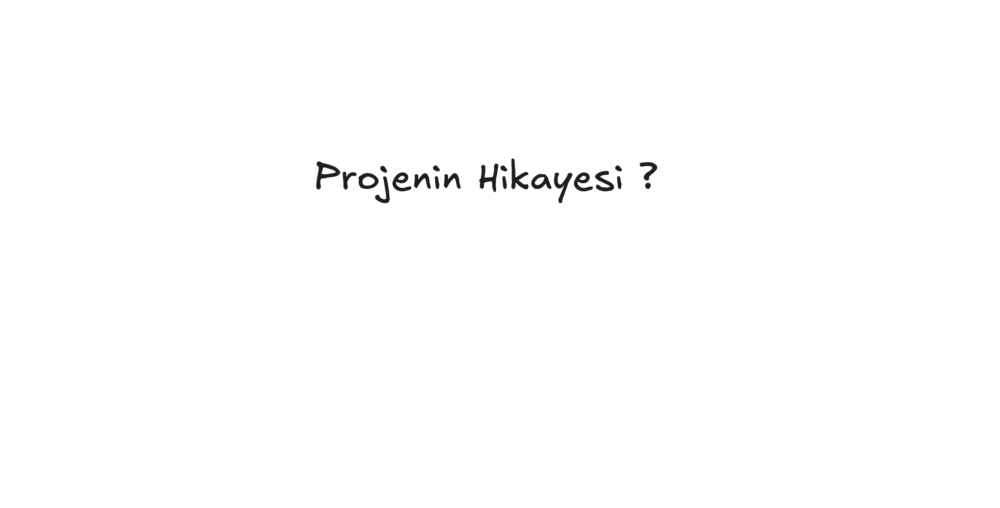

# LabProject Backend - NestJS

## 📋 Sprint Overview

<h3>🚀 Sprint 1 - Authentication & Authorization System</h3>

### 🎯 Sprint Goals
- Centralized authentication system
- JWT token management
- Role-based access control (RBAC)
- Swagger API documentation
- Pre-login and Post-login module separation

### 📸 Sprint 1 Screenshots

  

    
  

  

    
  

  

    
  

  

    
  

  

    
  

  

    
  

  

    
  

  

    
  

### ✅ Completed Features
- [x] User registration with validation
- [x] JWT-based authentication
- [x] Role-based access control (Admin/User)
- [x] Refresh token mechanism
- [x] Swagger API documentation
- [x] Password hashing with bcrypt
- [x] MongoDB integration
- [x] Error handling and validation

### 🛠️ Technical Stack
- **Backend:** NestJS, TypeScript
- **Database:** MongoDB with Mongoose
- **Authentication:** JWT, Passport.js
- **Documentation:** Swagger/OpenAPI
- **Security:** bcrypt, HttpOnly cookies

### 🔧 Key Components
- `AuthModule` - Centralized authentication
- `UsersModule` - User management
- `PreloginModule` - Pre-authentication operations
- `PostloginModule` - Post-authentication operations
- `RolesGuard` - Role-based access control
- `JwtAuthGuard` - JWT token validation

<h3>🚀 Sprint 2 - Coming Soon</h3>

<h3>🚀 Sprint 3 - Future Development</h3>

